

# LineTest: An Open-Source Digital Line Bisection Tool (cLBT)
*[Rini Varghese](https://github.com/rinivarg), [Jasmine Ma](https://github.com/Jasmine77766), [Carolee Winstein](https://github.com/cwinstein)* 

**Welcome to the GitHub page for the digital version of the Line Bisection Test!**   
The administration of this test has **2 EASY STEPS**:
 1. Download and run the cLBT installer
 2. Administer the test 
	
**See below for instructions on setup and administration.** 

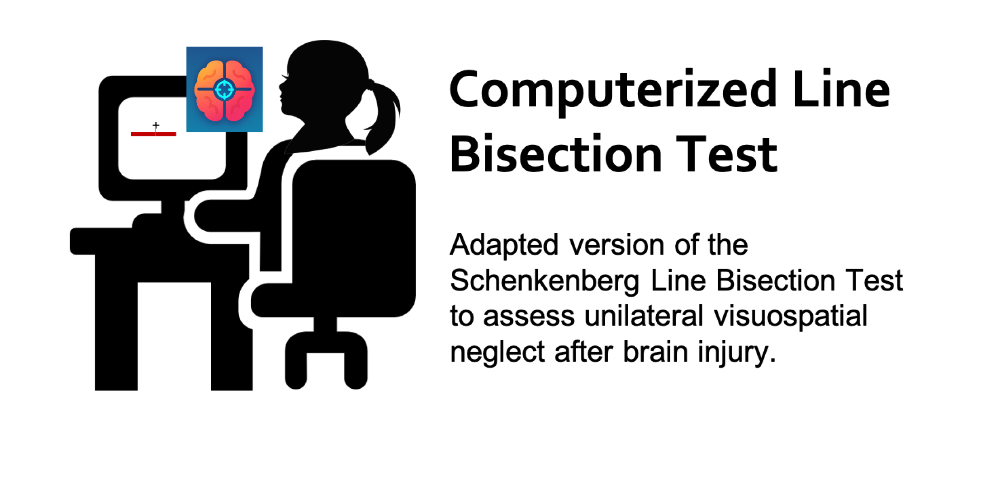

# Instructions for setup

  
Click to expand

	
## Step 1: Download and run the dLBT installer

- **Right-Click to download the installer for your platform (Mac or Windows):**   
	- [cLBT App for Mac](https://github.com/rinivarg/cLBT/blob/master/acquisition/cLBT_Mac.zip) (approx. 1.9 MB)  
	- [cLBT App for Windows](https://github.com/rinivarg/cLBT/blob/master/acquisition/cLBT_Windows.exe.zip) (approx. 3 MB)   
	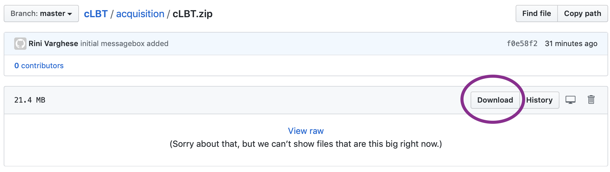
- Note that some computers are set up to automatically unzip the downloaded file. If so, proceed to the next step. Otherwise, unzip the file.

## Step 2: Administer the test! 
- The thumbnail for the app looks like this:  
	  
- The app is ready for use. Open and follow instructions!
- You may also see a MATLAB icon pop up in the background when you open the app. 

## Note:
- When you open the app, if you see a message like below due to your computer's firewall settings, please click ***Cancel***:  
	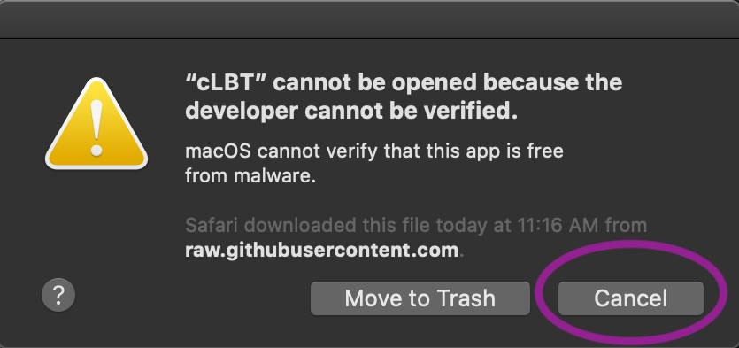  

- Then, similar to other apps that you might use, please grant permission to open the app by going to Settings or System Preferences.   
On a Mac, you can go to	*System Preferences > Security & Privacy* and clicking on ***Open Anyway***  
	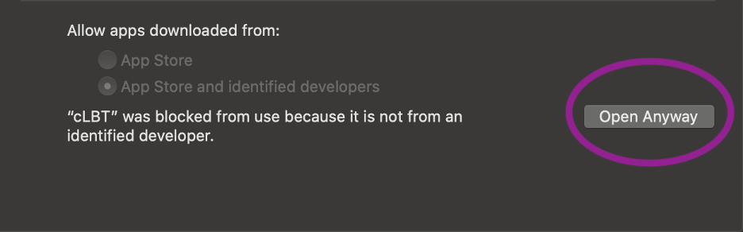  
	
- In the message box, confirm by clicking ***Open***. You will only need to grant this permission on the first use.

****

 

# How to administer the test?

  
Click to expand
 
	
1) **Screen:** It is recommended to use a screen that is at least 15" in size and is placed 2 feet away (depending on the size of your screen).
3) **Hand:** Use the right (or left) hand. It is advisable to use the hand which you think is proficient at using the computer mouse. Stroke surviovrs use their less-weaker hand while the other hand rests on the lap.
2) **Mouse:** It is recommended to use a wired or wireless mouse to use the pen tool instead of the trackpad of a laptop. Press and hold the left mouse key to activate the pen tool. Wait for the crosshairs to appear before you begin.
4) **Instructions:** Must include the following elements:
	- Draw a small vertical line through each line as close to its center as possible. 
	- You are only allowed a single try per line. Try to be as accurate as you can.
	- Mark on every line the best you can, without skipping.
	- Do not move the screen closer or to any one side.

****

 

# How does the app work?

  
Click to expand
 
	
1) Open the app. Note that sometimes the app takes a few seconds to open up. Please be patient.
2) You should see a *Welcome* message.
3) After you click **OK**, a dialog box appears asking for 3 required inputs:

<table style="border: none;">
<tr>
<td style="border: none;">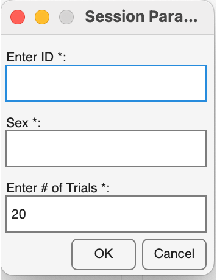</td>
<td style="border: none;">

**(1) Enter a Participant `ID`.**  
This ID will be the unique identifiers for your data in the output files and folder.

**(2) Enter `sex`.**  
Provide a single letter, this string will be appended to the `ID` in your data output file.

**(3) Enter Number of Trials.**  
A default value of 20 appears but you can change this. Use any whole number starting from 1.

</td>
</tr>
</table>
4) NEW Feature! Next, you will have the option to randomize the workspace locations as well as the lengths of the lines. 
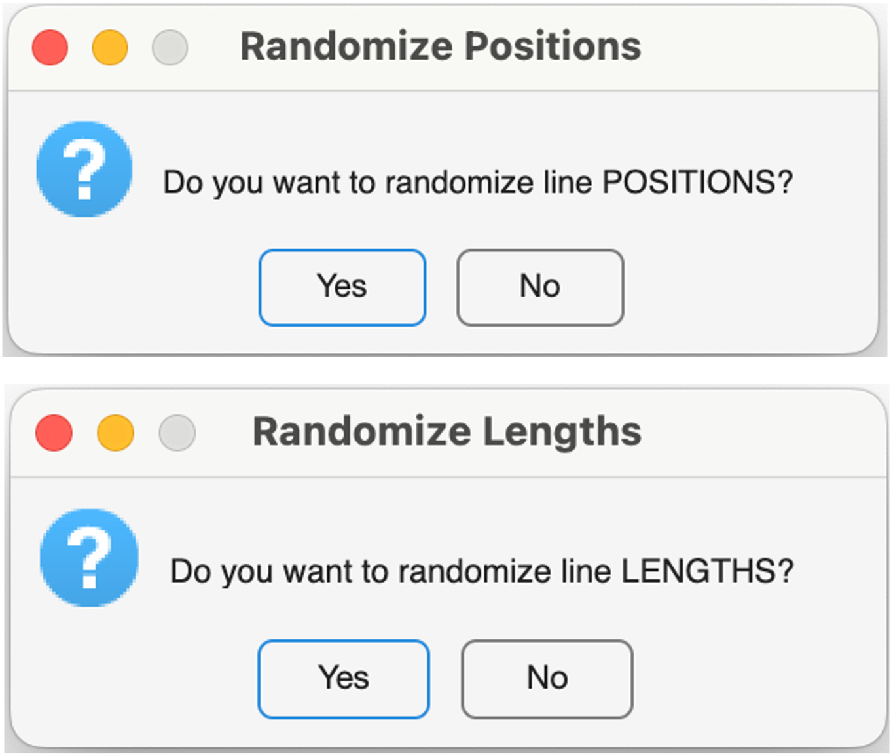  
5) Next, you will be prompted to ***Select*** a location to save your output files. 
		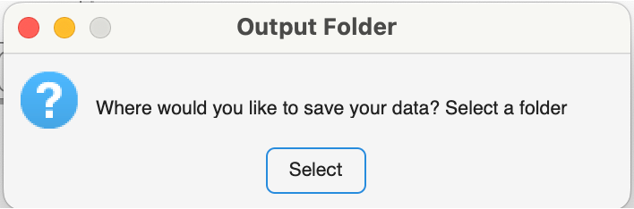  
6) Once you have selected your desired location, you will see the instructions for the task: 
		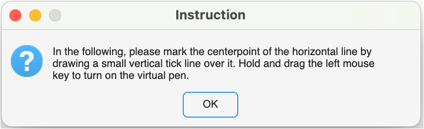  
7) Draw a short vertical line to indicate your response (see below): 
		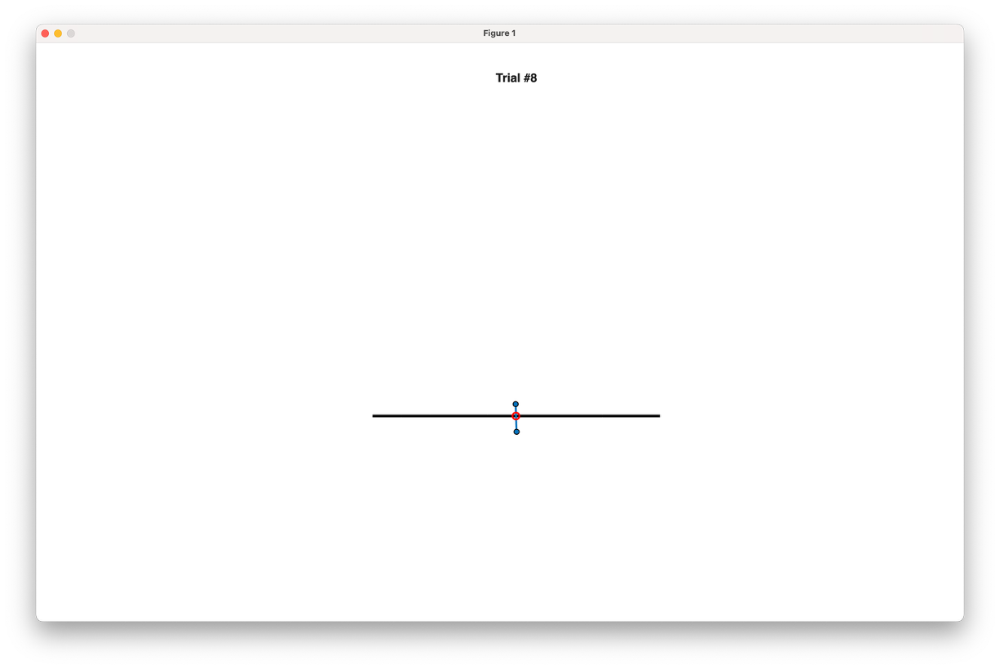  
8) After you have completed all the trials, you will see a summary figure (see below). 
		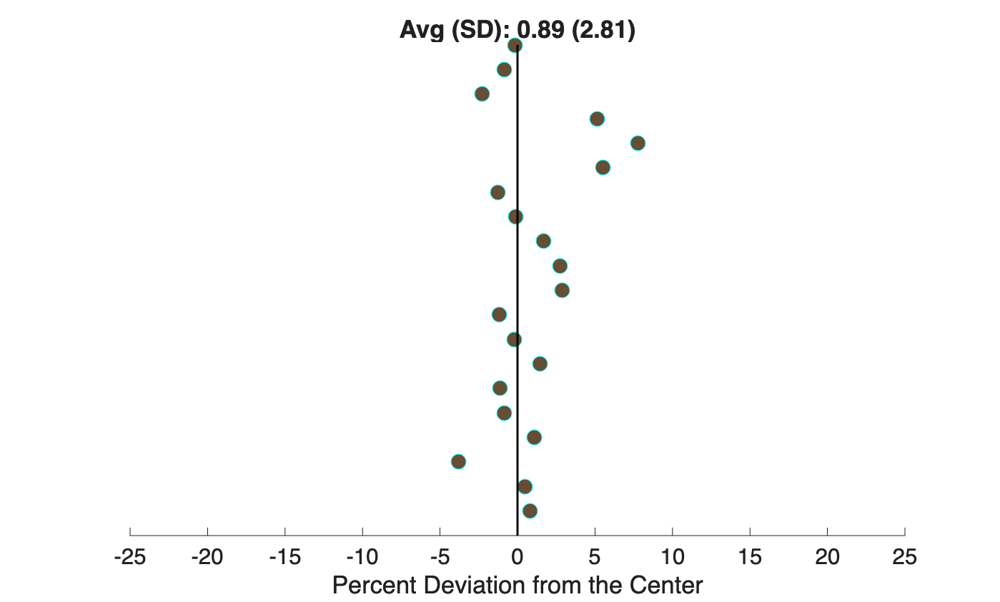  
9) You will also see a *Thank you* message. The app will close when you close these windows.
		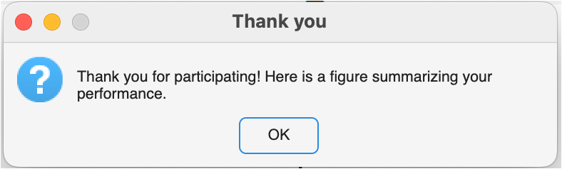  
10) Your output data folder is saved at the destination that you indicated at the start of the test and will be named: **LBT_`[ID_sex]`** 

****

 

# What does the output folder contain?

  
Click to expand
 
	
The output folder contains the following files:  
- **00a_LBT_summary.tiff** This is the summary image file that you see at the end of the test. 
- **00b_Average_Report_LBT_`[ID_sex]`.txt** This file contains the average absolute and percent deviation across all trials. It also contains the total time taken to complete the test (in seconds).  
- **00b_TrialWise_Report_LBT_`[ID_sex]`.txt** This file containts the trial-wise absolute (in a.u.) and percent deviations across all trials. The trial-wise file also outputs two additional variables: WorkspaceX and WorkspaceY. These two variables define the quadrant in which the line appeared. For example, ***left*** (WorkspaceX) and ***bottom*** (WorkspaceY). 
- **LBT_`[ID_sex]`.mat** Contains raw trial-wise data with x and y cursor position data. Note that you will only be able to open this file if you have MATLAB installed on your machine. 
- **log_[mm-dd-yyyy-hh-mm].txt** Log file containing outputs from the MATLAB command window. Will contain any errors in running the app. If no errors, it will report the mean and sd of percent deviation from the center, [NEW measure] the enpoint weights and weighting bias, and the total time taken to complete the test. 
- **LBT_[`ID_sex`_trial#].jpeg**  Low-res image files for each trial showing participant performance.

See here for an [example data folder](https://github.com/rinivarg/cLBT/tree/master/example/LBT_051020rv_F)
****

 

## Questions/Comments? 
- If you have any questions or suggestions for improvement, please post them through  
- You can also contact the first author directly at rvarghe9@jhmi.edu  
- Source code available upon request.  

## References 
1. **Schenkenberg T, Bradford DC, Ajax ET.** [Line bisection and unilateral visual neglect in patients with neurologic impairment.](https://github.com/rinivarg/cLBT/blob/master/LBT_Schenkenberg_1980.pdf) *Neurology.* 1980;30:509–17. 

## Acknowledgements
Thank you to early users and testers of this app: Jonathan Tsay, Evrim Gökçe, and DJ Eversley. Your feedback made this better! 

## How to cite this?
**Varghese, R, Ma, J, and, Winstein CJ.** (June 2, 2020). A Computerized Version of the Line Bisection Test (v.1.2). GitHub. GitHub repository: https://github.com/rinivarg/cLBT/#667c1f6

	@misc{Varghese2020,
	  author = {Varghese, Rini, Ma, Jasmine, and Winstein, Carolee},
	  title = {A Computerized Version of the Line Bisection Test},
	  year = {2020},
	  publisher = {GitHub},
	  journal = {GitHub repository},
	  howpublished = {\url{https://github.com/rinivarg/cLBT}},
	  commit = {#667c1f6}
	}
