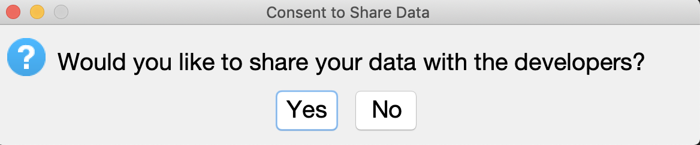

# Computerized Line Bisection Test (cLBT)
*Rini Varghese, Jasmine Ma, Carolee Winstein*  
**Welcome to the GitHub page for the computerized version of the Schenkenberg Line Bisection Test to assess spatial neglect.**

# Instructions for setup
## Step 1: Download MATLAB Runtime 
The MATLAB Runtime is a standalone set of shared libraries that enables the execution of compiled MATLAB applications or components. Note, however, that the Runtime file is quite large (1.5-1.7GB)
**Right-Click on this link and open in a new tab:** https://www.mathworks.com/products/compiler/matlab-runtime.html  
As shown below, open the *R2019a (9.6) version suited to your platform (Mac, Windows, or Linux)

## Step 2: Install the MATLAB Runtime
- Double-Click on the downloaded MATLAB Runtime file from your Downloads folder. 

- Follow steps for installation.

## Step 3: Download the cLBT.zip file
**Right-Click on this link and open in a new tab:** [Line Bisection Test App](https://github.com/rinivarg/cLBT/blob/master/acquisition/cLBT.zip)  

Note that some computers are set up to automatically unzip the downloaded file. If so, proceed to the next step. Otherwise, unzip the file.

## Step 4: The app is ready for use. 
The app thumbnail looks something like this:  
Open and follow instructions!
****
# What does the app look like?
1) Open the app. 
2) Note that sometimes the app takes a few seconds to open up. Please be patient.
3) You should see a Welcome message.
4) After you click "OK," you will be asked if you are willing to share your data with us:

5) Once you have entered your choice, dialog box asking for 3 inputs:

	1. **Enter an appropriate ID.**
		- Remember this ID will be the Participant ID in your data output file. 
	2. **Enter Gender.**
		- Advisable to use a single letter: M (Male), F (Female), or N (Not disclosed)
	3. **Enter Number of Trials.**
		- You can use any whole number starting from 1. 
		- It is advisable to use at least 10 trials, but you can use more.  
4) Click "OK"
5) Next, you will see the instructions for the task:

5) Next, you will see the first trial for the line bisection. Wait to see the cross-hairs (like below) before you mark the midpoint of the horizontal line. Note that the horizontal line will appear in different quadrants of the screen.

6) Draw a short vertical line to indicate your response (like below):

7) After you have completed all the trials, you will see a summary figure (like below) and a "Thank you" message. 
 
Your output data folder is saved on your Desktop with the following name: "LBT_yourID_yourGender"
8) The app will close when you close these windows.

