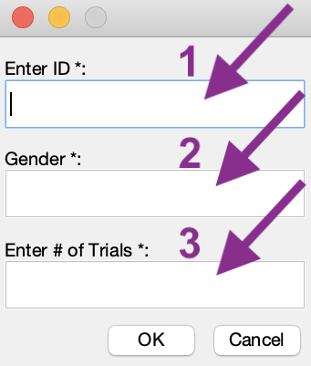

# Computerized Line Bisection Test (cLBT)
*Rini Varghese, Jasmine Ma, Carolee Winstein*  
**Welcome to the GitHub page for the computerized version of the Computerized Line Bisection Test** 

# Instructions for setup

  
Click to expand

	
## Step 1: Download MATLAB Runtime 
- The MATLAB Runtime is a FREE standalone set of shared libraries that enables the execution of compiled MATLAB applications or components.  
- Note that the Runtime file is quite large (1.7-2 GB). 
- **Right-Click on this link and open in a new tab:** https://www.mathworks.com/products/compiler/matlab-runtime.html  
- As shown below, download the *R2019a (9.6)* version suited to your platform (Mac, Windows, or Linux) 
	

## Step 2: Install the MATLAB Runtime
- Double-Click on the downloaded MATLAB Runtime file from your *Downloads* folder. 
	
- Follow steps for installation.

## Step 3: Download the cLBT.zip file
- **Right-Click on this link and open in a new tab:** [Line Bisection Test App](https://github.com/rinivarg/cLBT/blob/master/acquisition/cLBT.zip)  
	
- Note that some computers are set up to automatically unzip the downloaded file. If so, proceed to the next step. Otherwise, unzip the file.

## Step 4: The app is ready for use. 
- The thumbnail for the app looks like this:  
	  
- Open and follow instructions!
****

 

# How to administer the test?

  
Click to expand

****

 

# How does the app work?

  
Click to expand
 
	
1) Open the app. 
2) Note that sometimes the app takes a few seconds to open up. Please be patient.
3) You should see a *Welcome* message.
4) After you click **OK**, you will be asked if you are willing to share your data with us: 
		
5) Once you have entered your choice, dialog box asking for 3 inputs: 
		 
		(1) **Enter an appropriate ID.**
			Remember this ID will be the Participant ID in your data output file.  
		(2) **Enter Gender.**
			Advisable to use a single letter: M (Male), F (Female), or N (Not disclosed) 
		(3) **Enter Number of Trials.**
			You can use any whole number starting from 1. 
			It is advisable to use at least 10 trials, but you can use more.
6) Click **OK**
7) Next, you will see the instructions for the task: 
		
8) Next, you will see the first trial for the line bisection. Wait to see the cross-hairs (see below) before you mark the midpoint of the horizontal line. Note that the horizontal line will appear in different quadrants of the screen. 
		
9) Draw a short vertical line to indicate your response (see below): 
		
10) After you have completed all the trials, you will see a summary figure (see below) and a *Thank you* message. 
		
11) Your output data folder is saved on your *Desktop* with the following name: **[LBT_yourID_yourGender]** 
12) The app will close when you close these windows.
****

 

# What does the output folder contain?

  
Click to expand

The output folder saved within the *Desktop* folder contains 1 summary image (.tiff), 2 plain text files containing the data (.txt), 1 MATLAB data file (.mat), 1 plain text log file (.txt), and finally, raw image files for each trial (.jpeg). Below are more details:  
	1) **00a_LBT_summary.tiff** This is the summary image file that you see at the end of the test. 
	2) **00b_Average_Report_[LBT_yourID_yourGender]** This file contains the average absolute and percent deviation across all trials. 
	3) **00b_TrialWise_Report_[LBT_yourID_yourGender]** This file containts the trial-wise absolute and percent deviations across all trials. 
	4) **[LBT_yourID_yourGender]** Contains raw trial-wise data with x and y cursor position data in a .mat file. 
	5) **log_mm-dd-yyyy-hh-mm** Log file containing outputs from the MATLAB command window. Will contain any errors in running the app. If no errors, it will report the average and standard deviation info. 
	
****

 
