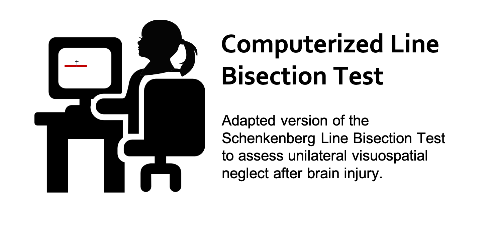

# Computerized Line Bisection Test (cLBT)
*Rini Varghese, Jasmine Ma, Carolee Winstein*  
**Welcome to the GitHub page for the computerized version of the Computerized Line Bisection Test** 

# Instructions for setup

  
Click to expand

	
## Step 1: Download MATLAB Runtime 
- The MATLAB Runtime is a FREE standalone set of shared libraries that enables the execution of compiled MATLAB applications or components.  
- Note that the Runtime file is quite large (1.7-2 GB). 
- **Right-Click on this link and open in a new tab:** https://www.mathworks.com/products/compiler/matlab-runtime.html  
- As shown below, download the *R2019a (9.6)* version suited to your platform (Mac, Windows, or Linux) 
	

## Step 2: Install the MATLAB Runtime
- Double-Click on the downloaded MATLAB Runtime file from your *Downloads* folder. 
	
- Follow steps for installation.

## Step 3: Download the cLBT.zip file
- **Right-Click on this link and open in a new tab:** [Line Bisection Test App](https://github.com/rinivarg/cLBT/blob/master/acquisition/cLBT.zip)  
	
- Note that some computers are set up to automatically unzip the downloaded file. If so, proceed to the next step. Otherwise, unzip the file.

## Step 4: The app is ready for use. 
- The thumbnail for the app looks like this:  
	  
- Open and follow instructions!
****

 

# How to administer the test?

  
Click to expand
 
	
1) **Screen:** It is recommended to use a screen that is at least 15" in size and is placed 2 feet away (depending on the size of your screen).
3) **Hand:** Use the right (or left) hand. It is advisable to use the hand which you think is proficient at using the computer mouse. Stroke surviovrs use their less-weaker hand. The other hand must rest on the lap.
2) **Mouse:** It is recommended to use a wired or wireless mouse to use the pen tool instead of the trackpad of a laptop. Press and hold the left mouse key to activate the pen tool. Wait for the crosshairs to appear before you begin.
4) **Instructions:** Must include the following elements:
	- For each horizontal line in half by drawing a small vertical line through each line as close to its center as possible. 
	- You are only allowed a single try per line. Try to be as accurate as you can.
	- Mark on every line the best you can, without skipping.
	- Do not move the screen closer or to any one side.

****

 

# How does the app work?

  
Click to expand
 
	
1) Open the app. Note that sometimes the app takes a few seconds to open up. Please be patient.
2) You should see a *Welcome* message.
3) After you click **OK**, you will be asked if you are willing to share your data with us: 
		
4) Once you have entered your choice, a dialog box appears asking for 3 required inputs: 
		 
		(1) **Enter an appropriate ID.**
			This ID will be the Participant ID in your data output file.  
		(2) **Enter Gender.**
			Use a single letter: M (Male), F (Female), or N (Not disclosed).  
		(3) **Enter Number of Trials.**
			You can use any whole number starting from 1. 
			It is advisable to use at least 10 trials, but you can use more.
5) Click **OK**
6) Next, you will see the instructions for the task: 
		
7) Next, you will see the first trial for the line bisection. Wait to see the cross-hairs (see below) before you mark the midpoint of the horizontal line. Note that the horizontal line will appear in different quadrants of the screen. 
		
8) Draw a short vertical line to indicate your response (see below): 
		 

<video width="618" height="347" controls preload> 
    <source src="images/lbt_small_vid.mp4" media="only screen and (min-device-width: 568px)"></source>
    <source src="images/lbt_small_vid.iphone.mp4" media="only screen and (max-device-width: 568px)"></source>
</video>

9) After you have completed all the trials, you will see a summary figure (see below) and a *Thank you* message. 
		
10) Your output data folder is saved on your *Desktop* with the following name: **LBT_[yourID_yourGender]** 
11) The app will close when you close these windows.
****

 

# What does the output folder contain?

  
Click to expand
 
	
The output folder saved within the *Desktop* folder and contains the following files:  
- **00a_LBT_summary.tiff** This is the summary image file that you see at the end of the test. 
- **00b_Average_Report_LBT_[yourID_yourGender].txt** This file contains the average absolute and percent deviation across all trials. It also contains the total time taken to complete the test (in seconds).  
- **00b_TrialWise_Report_LBT_[yourID_yourGender].txt** This file containts the trial-wise absolute and percent deviations across all trials. The trial-wise file also outputs two additional variables: WorkspaceX and WorkspaceY. These two variables define the quadrant in which the line appeared. For example, ***left*** (WorkspaceX) and ***bottom*** (WorkspaceY). 
- **LBT_[yourID_yourGender].mat** Contains raw trial-wise data with x and y cursor position data. Note that you will only be able to open this file if you have MATLAB installed on your machine. 
- **log_[mm-dd-yyyy-hh-mm].txt** Log file containing outputs from the MATLAB command window. Will contain any errors in running the app. If no errors, it will report the average and standard deviation info. 
- **LBT_[yourID_yourGender_trial#].jpeg**  Low-res image files for each trial showing participant performance.

See here for an [example data folder](https://github.com/rinivarg/cLBT/tree/master/example/LBT_051020rv_F)
****

 

## References 
1. **Schenkenberg T, Bradford DC, Ajax ET.** [Line bisection and unilateral visual neglect in patients with neurologic impairment.](https://github.com/rinivarg/cLBT/blob/master/LBT_Schenkenberg_1980.pdf) *Neurology.* 1980;30:509–17. 

## How to cite this?
**Varghese, R, Ma, J, and, Winstein CJ.** (May 9, 2020). A Computerized Version of the Line Bisection Test (v.1.1). GitHub. GitHub repository: https://github.com/rinivarg/cLBT/#f0e58f2

	@misc{Varghese2020,
	  author = {Varghese, Rini, Ma, Jasmine, and Winstein, Carolee},
	  title = {A Computerized Version of the Line Bisection Test},
	  year = {2020},
	  publisher = {GitHub},
	  journal = {GitHub repository},
	  howpublished = {\url{https://github.com/rinivarg/cLBT}},
	  commit = {#f0e58f2}
	}
